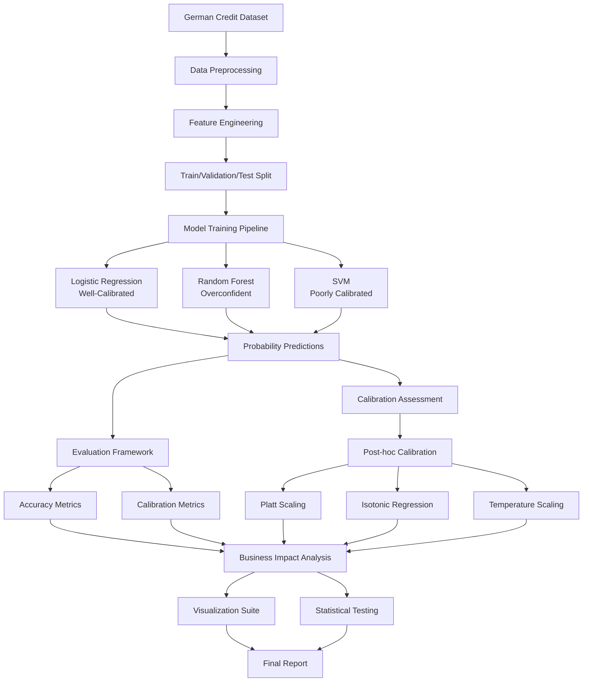
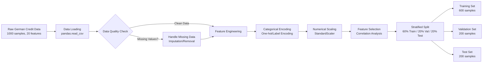
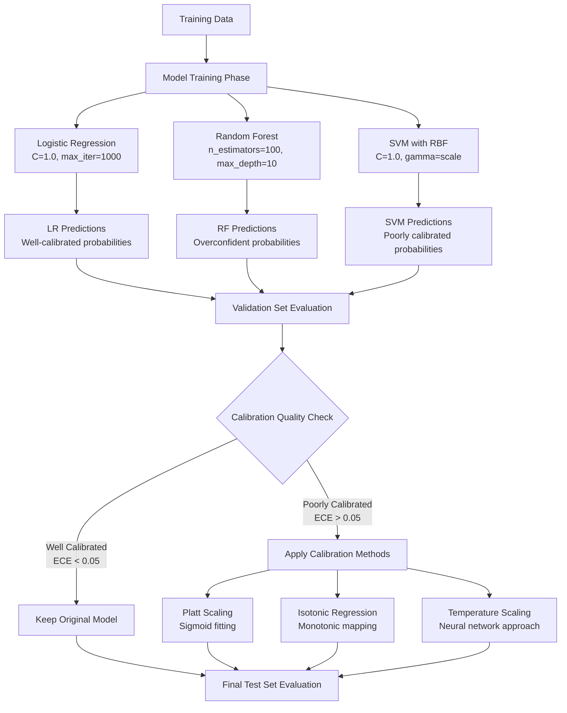
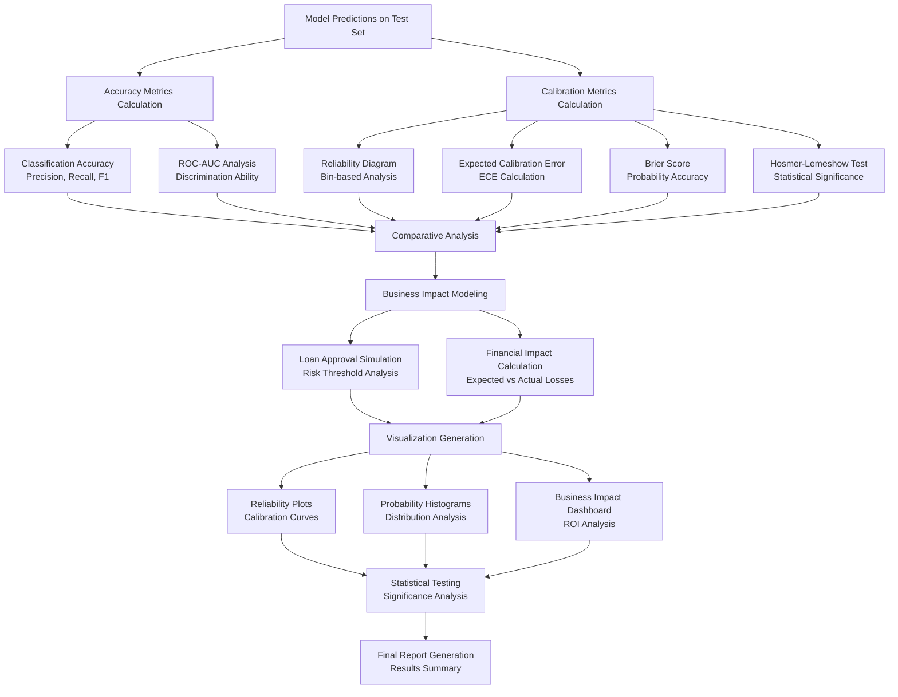
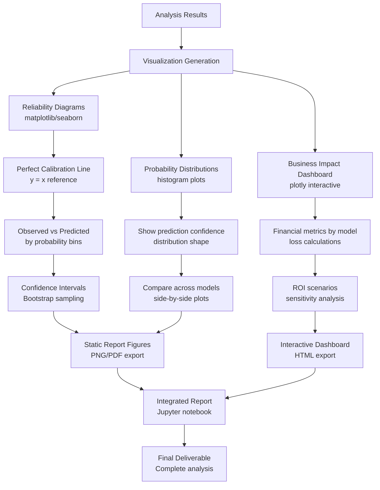

# Experimental Flow Diagram

This document contains the complete flow diagrams for the Credit Scoring Experiment, showing the data flow, model training pipeline, and evaluation process.

## Overall System Architecture



## Detailed Data Pipeline



## Model Training and Evaluation Pipeline



## Evaluation and Analysis Framework



## Calibration Methods Detail Flow

```mermaid
graph LR
    A[Uncalibrated Model Predictions] --> B{Calibration Method Selection}
    
    B --> C[Platt Scaling]
    C --> C1[Fit Sigmoid Function<br/>P_cal = 1/(1+exp(A*P+B))]
    C1 --> C2[Optimize A and B parameters<br/>on validation set]
    C2 --> C3[Apply to test predictions]
    
    B --> D[Isotonic Regression]
    D --> D1[Fit Monotonic Function<br/>Non-parametric approach]
    D1 --> D2[Preserve probability ordering<br/>while improving calibration]
    D2 --> D3[Apply to test predictions]
    
    B --> E[Temperature Scaling]
    E --> E1[Add temperature parameter T<br/>P_cal = softmax(logits/T)]
    E1 --> E2[Optimize T on validation set<br/>minimize NLL]
    E2 --> E3[Apply to test predictions]
    
    C3 --> F[Calibrated Predictions]
    D3 --> F
    E3 --> F
    
    F --> G[Post-calibration Evaluation]
    G --> H[Compare ECE before/after]
    G --> I[Assess impact on accuracy]
    G --> J[Business impact analysis]
```

## Business Impact Analysis Flow

```mermaid
graph TD
    A[Calibrated vs Uncalibrated Predictions] --> B[Define Business Scenario]
    B --> C[Credit Approval Decision<br/>Threshold: P(default) < 0.3]
    
    C --> D[Simulate Loan Portfolio<br/>10,000 loans, $10K average]
    
    D --> E[Well-Calibrated Model Scenario]
    D --> F[Overconfident Model Scenario]
    
    E --> E1[Predicted Risk: 20%<br/>Actual Risk: 22%]
    E1 --> E2[Expected Loss: $2M<br/>Actual Loss: $2.2M]
    E2 --> E3[Difference: $200K<br/>Manageable Risk]
    
    F --> F1[Predicted Risk: 5%<br/>Actual Risk: 25%]
    F1 --> F2[Expected Loss: $500K<br/>Actual Loss: $2.5M]
    F2 --> F3[Difference: $2M<br/>Significant Risk]
    
    E3 --> G[ROI Calculation for Calibration]
    F3 --> G
    
    G --> H[Cost of Calibration<br/>Development + Validation]
    G --> I[Benefit of Calibration<br/>Risk Reduction]
    
    H --> J[ROI = (Benefit - Cost) / Cost]
    I --> J
    
    J --> K[Business Recommendation<br/>Implement Calibration]
```

## Visualization Pipeline



## File Organization Structure

```mermaid
graph TD
    A[credit_scoring_experiment/] --> B[docs/]
    A --> C[data/]
    A --> D[models/]
    A --> E[visualization/]
    A --> F[results/]
    A --> G[notebooks/]
    A --> H[README.md]
    A --> I[requirements.txt]
    
    B --> B1[VISION_DOCUMENT.md]
    B --> B2[FLOW_DIAGRAM.md]
    B --> B3[API_DOCUMENTATION.md]
    
    C --> C1[raw/german_credit.csv]
    C --> C2[processed/train_test_split.pkl]
    
    D --> D1[train_models.py]
    D --> D2[calibration.py]
    D --> D3[evaluation.py]
    D --> D4[model_configs.json]
    
    E --> E1[reliability_plots.py]
    E --> E2[business_impact.py]
    E --> E3[probability_distributions.py]
    
    F --> F1[model_metrics.csv]
    F --> F2[calibration_results.json]
    F --> F3[business_impact_analysis.pdf]
    
    G --> G1[01_data_exploration.ipynb]
    G --> G2[02_model_training.ipynb]
    G --> G3[03_calibration_analysis.ipynb]
    G --> G4[04_business_impact.ipynb]
```



---

*These diagrams provide a comprehensive view of the experimental design and implementation flow. Each component is designed to be modular and testable, ensuring reproducibility and educational value.*