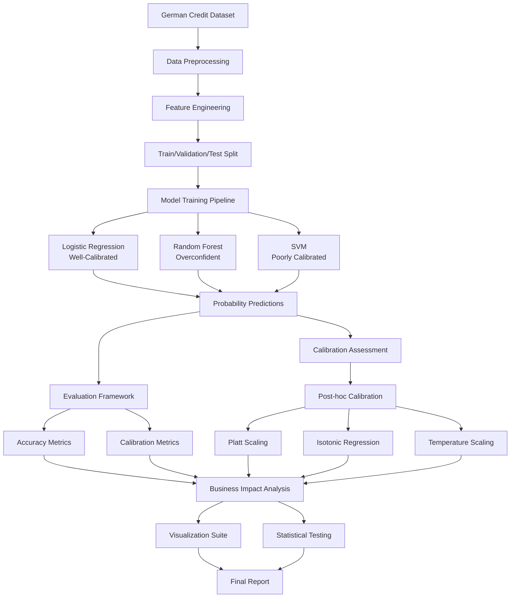
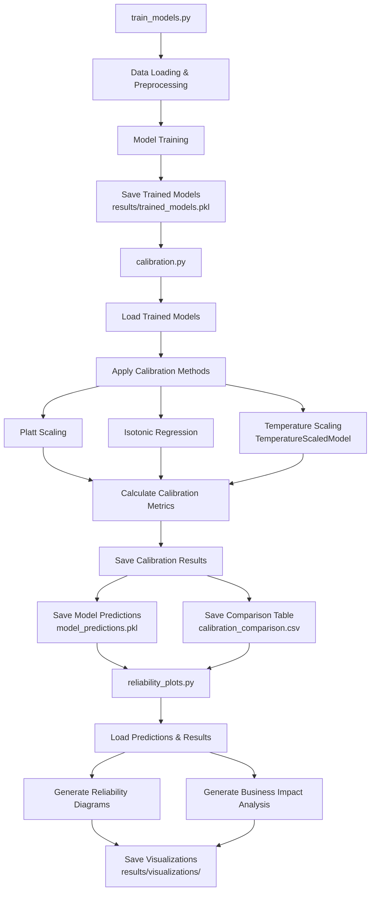
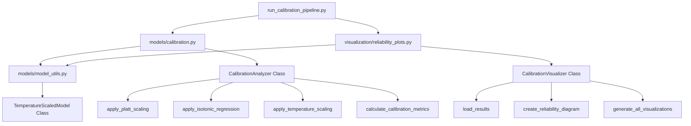
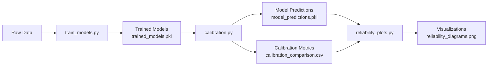
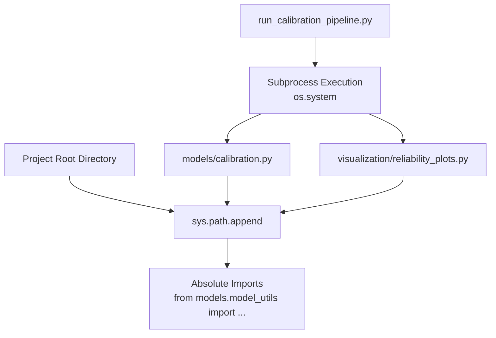
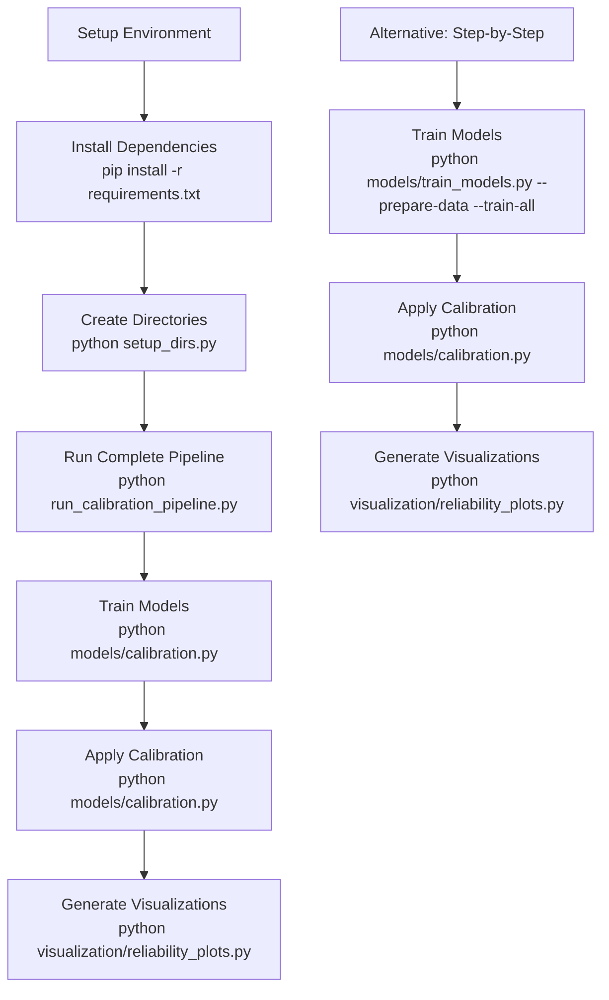
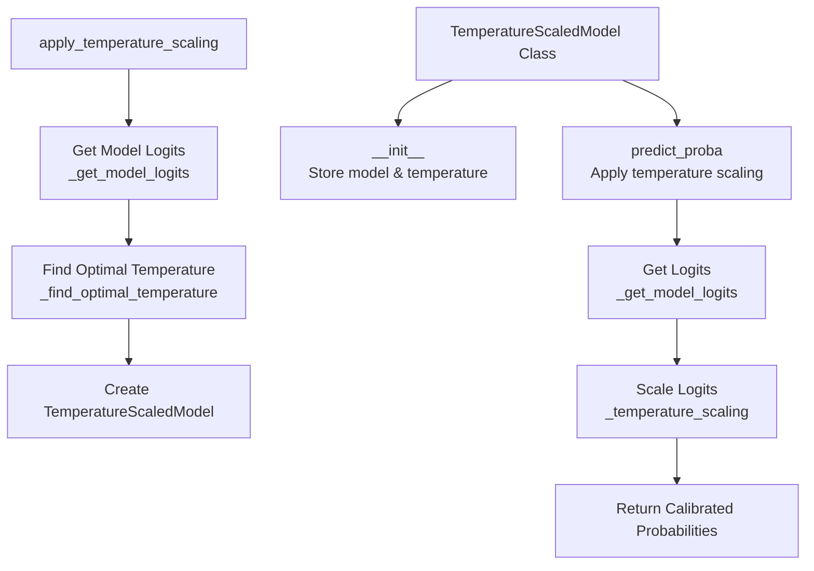
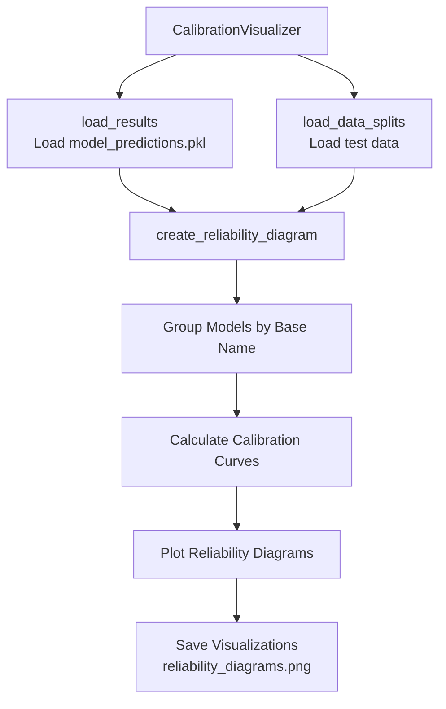

# Experimental Flow Diagram

This document contains the complete flow diagrams for the Credit Scoring Experiment, showing the data flow, model training pipeline, and evaluation process.

## Overall System Architecture

## Detailed Implementation Architecture

## Module Structure and Dependencies

## Data Flow and Serialization

## Python Path and Import Resolution

## Execution Flow

## Temperature Scaling Implementation

## Visualization Pipeline

## File Organization Structure

```mermaid
graph TD
    A[credit_scoring_experiment/] --> B[docs/]
    A --> C[data/]
    A --> D[models/]
    A --> E[visualization/]
    A --> F[results/]
    A --> G[notebooks/]
    A --> H[README.md]
    A --> I[requirements.txt]
    
    B --> B1[VISION_DOCUMENT.md]
    B --> B2[FLOW_DIAGRAM.md]
    B --> B3[API_DOCUMENTATION.md]
    
    C --> C1[raw/german_credit.csv]
    C --> C2[processed/train_test_split.pkl]
    
    D --> D1[train_models.py]
    D --> D2[calibration.py]
    D --> D3[evaluation.py]
    D --> D4[model_configs.json]
    
    E --> E1[reliability_plots.py]
    E --> E2[business_impact.py]
    E --> E3[probability_distributions.py]
    
    F --> F1[model_metrics.csv]
    F --> F2[calibration_results.json]
    F --> F3[business_impact_analysis.pdf]
    
    G --> G1[01_data_exploration.ipynb]
    G --> G2[02_model_training.ipynb]
    G --> G3[03_calibration_analysis.ipynb]
    G --> G4[04_business_impact.ipynb]
```

---

*These diagrams provide a comprehensive view of the experimental design and implementation flow. Each component is designed to be modular and testable, ensuring reproducibility and educational value.*
